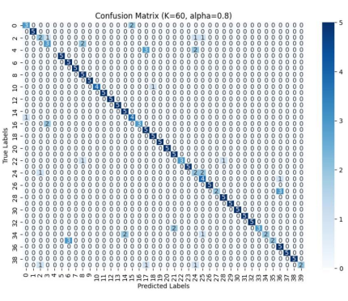
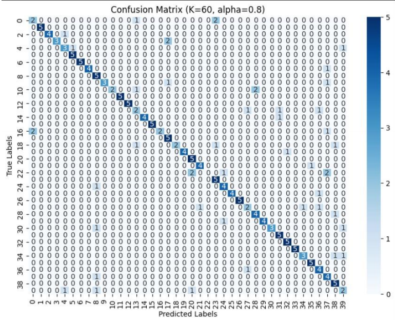
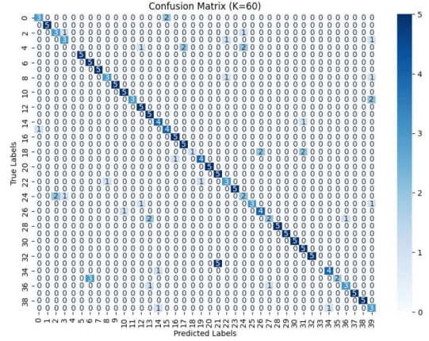
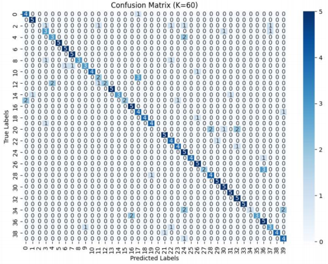
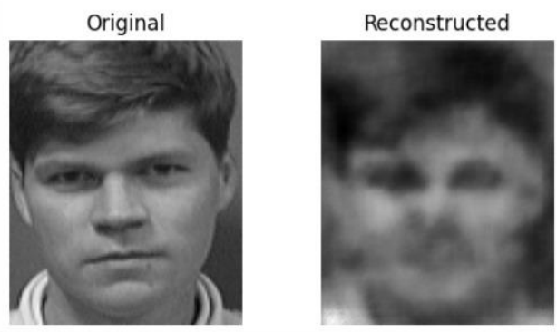

# Face Recognition

---

## Problem Statement

This project, developed for the Pattern Recognition course at Alexandria University, implements **unsupervised face recognition and clustering** using the **ORL face dataset**. The core components include **dimensionality reduction (PCA and Autoencoder)** and **clustering (K-Means, GMM)**, fully built from scratch for educational and performance evaluation purposes.

---

## 📁 Dataset

* **ORL Face Dataset**: 40 subjects × 10 grayscale images (92×112 pixels).
* Images were vectorized (10304-dim) and normalized.
* Dataset split: 5 images/person for training and 5 for testing.

---

## 📉 Dimensionality Reduction

### Principal Component Analysis (PCA)

* Implemented from scratch.
* Retained variance thresholds: α = {0.80, 0.85, 0.90, 0.95}.
* Used for projecting original data to lower dimensions while preserving facial structure.

### Autoencoder

* Convolutional Autoencoder reduced images to 42D embeddings.
* Used embeddings for downstream clustering.
* Also reconstructed sample images to validate dimensional compression.

---

## 📊 Clustering Methods

### K-Means Clustering

* Custom implementation with centroid convergence and cluster-to-label mapping.
* Accuracy evaluated across K values (K ∈ {20, 40, 60}).

### Gaussian Mixture Model (GMM)

* Scratch-built EM algorithm with log-probability calculations for numerical stability.
* Multiple random initializations, early stopping, and covariance regularization.
* Evaluated across same K values.

---

## 🧪 Evaluation 

* **Confusion Matrix**
  * PCA
    * KMeans
    * 
    * GMM
    * 
  * Autoencoder
    * KMeans
    * 
    * GMM
    * 

---

## 🔍 Best Scores 

| Model                | Dim. Reduction | K (Clusters) | Accuracy | F1 Score |
|---------------------|----------------|--------------|----------|----------|
| PCA + KMeans         | α = 0.8        | 60           | 82.0%    | 80.6%    |
| PCA + GMM            | α = 0.8        | 60           | 76.5%    | 75.2%    |
| Autoencoder + KMeans | -              | 60           | 77.0%    | 74.5%    |
| Autoencoder + GMM    | -              | 60           | 74.5%    | 71.9%    |

---

### 📈 Insights

* As **alpha increases**, **accuracy decreases** (overcompression).
* As **K increases**, **accuracy improves** (more expressive clustering).

---

### 📈 PCA vs Autoencoder

* PCA: **Linear** dimensionality reduction, **global** structure.
* Autoencoder: **Non-linear**, **local** structure.
* PCA Reconstruction
* 
* Autoencoder Reconstruction
* 
  
  

---

## 👨‍💻 Contributors

1. [**Mohamed Hassan**](https://github.com/mohassan5286)
2. [**Omar Hany**](https://github.com/OmarHani4306)
3. [**Mohamed Mohamed Ibrahim**](https://github.com/Mohamed-Mohamed-Ibrahim)

---

## 🙏 Acknowledgment

We would like to express our sincere gratitude to **Prof. Dr. Marwan Torki** and **Eng. Ismail El-Yamany** for their continuous support and valuable guidance throughout the course and this project.

---
